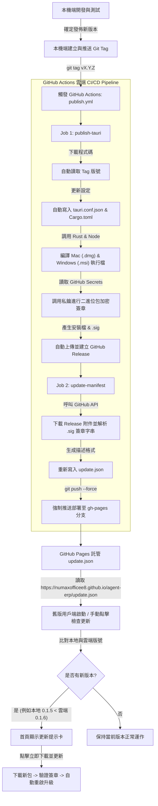

# AgentERP 版本發佈與自動更新指南

本指南說明如何為 AgentERP 邊緣工作站打包、簽章、發佈新版本，以及自動更新（Auto-Update）的運作流程。

---

## 1. 版本發佈與自動更新流程圖



---

## 2. 準備工作 (Prerequisites)

在您第一次發佈前，請確保以下安全設定已配置完畢：

1. **數位簽章金鑰對**：
   * 在本機執行過 `npx tauri signer generate` 產生金鑰對。
   * **公鑰 (Public Key)**：已填入 `src-tauri/tauri.conf.json` 的 `"plugins" > "updater" > "pubkey"` 中。
   * **私鑰 (Private Key)**：已配置於 GitHub 倉庫的 **Settings > Secrets > Actions** 中，變數名稱為 `TAURI_SIGNING_PRIVATE_KEY`（若有金鑰密碼則一併配置 `TAURI_SIGNING_PRIVATE_KEY_PASSWORD`）。
2. **GitHub Pages 託管啟用**：
   * 當第一次發佈 Tag 結束後，前往 GitHub 專案的 **Settings > Pages**。
   * 將 **Build and deployment > Source** 設為 `Deploy from a branch`。
   * 分支 (Branch) 選擇 **`gh-pages`**，資料夾選擇 **`/ (root)`**，點擊 **Save**。

---

## 3. 發佈新版本操作步驟

本機端開發人員發佈新版本的步驟非常簡單，僅需三行指令：

### 步驟 1：確保所有代碼已推送到 main
```bash
git push origin main
```

### 步驟 2：在本機標記新版本 Tag
Tag 必須符合 `v*` 格式（例如 `v0.1.6`）：
```bash
git tag v0.1.6
```

### 步驟 3：推送 Tag 觸發自動發佈
```bash
git push origin v0.1.6
```

---

## 4. 自動化發佈細節說明

* **版號自動同步**：在 Actions 中，Node.js 腳本會自動讀取您推送的 Tag 名字（如 `v0.1.6` ➜ `0.1.6`），並動態改寫 `Cargo.toml` 與 `tauri.conf.json` 的 `"version"` 欄位。因此**您在本機不需要手動修改版號**。
* **靜默推送**：直接對 `main` 分支進行 Push **不會**觸發任何編譯檢查。編譯檢查 (CI Build Check) **只會在您建立 Pull Request 時觸發**，以確保最大的開發流暢度並節省 GitHub Actions 的額度。
